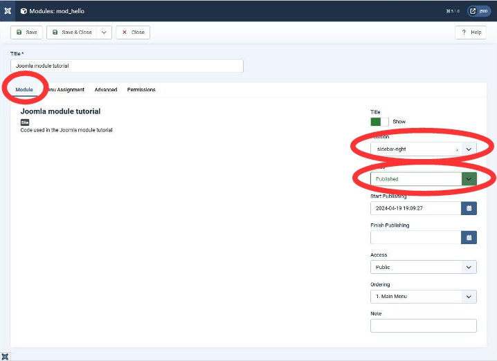

Step 1 Basic Module
===================

The aim of this first step is for you to have a working site module which you can see in your own Joomla instance.

In this first step the module will simply output the HTML

```html
<h4>Hello</h4>
```

The source code also available at [mod_hello step 1](https://github.com/joomla/manual-examples/tree/main/module-tutorial/step1_basic_module).

## Source Code

In this step you need to create 3 files in a folder called `mod_hello` as shown in this diagram:


### Manifest File

```xml title="mod_hello/mod_hello.xml"
<?xml version="1.0" encoding="UTF-8"?>
<extension type="module" client="site" method="upgrade">
    <name>Joomla module tutorial</name>
    <version>1.0.1</version>
    <author>me</author>
    <creationDate>today</creationDate>
    <description>Code used in the Joomla module tutorial</description>
    <namespace path="src">My\Module\Hello</namespace>
    <files>
        <folder module="mod_hello">services</folder>
        <folder>src</folder>
    </files>
</extension>
```

This file is called a "manifest" file and it tells the Joomla installer key information about the extension which you want to install:

- type="module" - the extension type is a module (rather than a component, plugin, etc)
- client="site" - this module is for the "site", aka the Joomla front-end. It's not for the administrator back-end.
- method="upgrade" - this is more relevant for the next tutorial step and means that the version being installed can be installed in place of an existing version (ie it's providing an upgrade)
- `<name>`, `<author>`, `<creationDate>`, `<description>` are all descriptive elements not validated by Joomla. When the module is installed you'll be able to see them by going to Content / Site Modules and System / Manage / Extensions.
- `<version>` - version of the module - you should update this with subsequent versions.
- `<files>` - tells the installer which files should be considered part of the module code. The module="mod_hello" attribute tells Joomla to look in the /services folder to find a service provider file which is the starting point of mod_hello. 
If you have files in your directory which haven't been explicitly included within the `<files>` section then the Joomla installer will ignore them.
- `<namespace>` - is the namespace prefix for our module mod_hello. It follows the [Joomla recommendation](../../../general-concepts/namespaces/defining-your-namespace.md), and we've used "My" as our company name. 

The path="src" attribute means that we should store our PHP classes in the /src subfolder, and we have to include it within the `<files>` element so that the Joomla installer processes it. 

Then the namespace prefix \My\Module\Hello\Site will point to this folder, and we should name our classes below it according to the [PSR-4 recommendation](https://www.php-fig.org/psr/psr-4/). 

Namespacing within Joomla is described in the [Namespaces section](../../../general-concepts/namespaces/index.md). 

Manifest files are described in [Manifest Files](../../install-update/installation/manifest.md).

### Service Provider File

Put into mod_hello/services/provider.php the following code:

```php title="mod_hello/services/provider.php"
<?php

\defined('_JEXEC') or die;

use Joomla\CMS\Extension\Service\Provider\Module as ModuleServiceProvider;
use Joomla\CMS\Extension\Service\Provider\ModuleDispatcherFactory as ModuleDispatcherFactoryServiceProvider;
use Joomla\CMS\Extension\Service\Provider\HelperFactory as HelperFactoryServiceProvider;
use Joomla\DI\Container;
use Joomla\DI\ServiceProviderInterface;

return new class () implements ServiceProviderInterface {

    public function register(Container $container): void
    {
        $container->registerServiceProvider(new ModuleDispatcherFactoryServiceProvider('\\My\\Module\\Hello'));
        $container->registerServiceProvider(new HelperFactoryServiceProvider('\\My\\Module\\Hello\\Site\\Helper'));
        $container->registerServiceProvider(new ModuleServiceProvider());
    }
};
```

If you're new to Joomla development then this code probably looks very intimidating. If so, the best thing is just to accept it for now. It's just boilerplate code that is used to link the Joomla core code with our mod_hello extension. We'll explain it in a later step of the tutorial.

### Dispatcher File

When Joomla runs our mod_hello code it starts by instantiating our Dispatcher class and calling its `dispatch()` function. 

```php title="mod_hello/src/Dispatcher/Dispatcher.php"
<?php
namespace My\Module\Hello\Site\Dispatcher;

\defined('_JEXEC') or die;

use Joomla\CMS\Dispatcher\DispatcherInterface;

class Dispatcher implements DispatcherInterface
{
    public function dispatch()
    {
        echo '<h4>Hello</h4>';
    }
```

The `_JEXEC` check at the start is a security feature. If someone enters a URL which points directly at this PHP source file, then the PHP interpreter will start running the code. 
To avoid a hacker gaining information about the code in a file this line checks if the constant "_JEXEC" has already been defined, and exits if it's not.
When Joomla runs normally it defines this "_JEXEC" constant, so when Joomla calls your module it will already have been defined. 

(The backslash in front of the `defined` function is just to indicate that we want to use the PHP `defined` function in the global namespace, rather than this file's namespace. Here it won't matter if we omit the backslash because we haven't got a local `defined` function, and PHP will revert to the global one if it doesn't find one here.)

## Installing your Module

Next zip up the folder mod_hello containing the 3 source files to create a file mod_hello.zip.

In your Joomla administrator back-end go to System / Install / Extensions and click on the Upload Package File tab:


Click on "browse for file" and select your mod_hello.zip to get Joomla to install it. You should then see a confirmation message:

"Installation of the module was successful."

together with text in your manifest file's `<description>` element.

Joomla stores your code in the /modules folder. If you open that folder then you should see your mod_hello folder and your file structure below it.

## Making your Module Visible

To make your module visible you have to do 3 things:
1. Publish your module
2. Define a template position for your module
3. Define which site pages will display your module

To do these, navigate in the administrator back-end to Content / Site Modules. You should see a module with title "Joomla module tutorial" (or whatever you entered as the `<name>` in the manifest file). 
You'll have a cross in the Status column indicating this module has the status of unpublished.

Click on the module title ("Joomla module tutorial") to edit the module information, and then the Module tab. 



In the Position field select "sidebar-right" as your module position.

In the Status field select "Published". 

Click on the Menu Assignment tab and in the Module Assignment field select "On all pages":

 "Set menu assignment")

Click on the Save and Close button. This should return to the list of site modules. 

Now in this list your "Joomla module tutorial" module should show a green tick in the Status column and have an entry "sidebar-right" in the Position column.

If you display a page on your website then you should see your module in the right-hand sidebar:


## Troubleshooting

If you get a Class not found exception then it means that Joomla can't find one of the classes you've specified in your code.

Check carefully 
- your `<namespace>` tag in the manifest file
- your `use` statements in your PHP file
- the class name in your PHP class file
- the filename of your PHP class file

Joomla will use the details to locate your class source file as described in [Finding Class Files with PSR-4](../../../general-concepts/namespaces/finding-classes-with-psr4.md).

Also ensure that your subdirectories under your /src folder, and the filenames of your PHP class files have the correct capitalisation. 
If you're developing under Windows then the operating system ignores the difference between small letters and capitals in filenames.
If you then install your extension on a live site which is running on linux you may find a Class Not Found exception because linux isn't as forgiving.

## Finding Template Positions

In the previous section I suggested that you used "sidebar-right" as your module Position. 
However, you will have noticed that there were lots of possible positions to choose from. 
So how do you know which one to choose?

If you're using the default Joomla site template Cassiopeia then you can view the template positions [here](https://docs.joomla.org/J4.x:Cassiopeia_Template_Customisation#Cassiopeia_Template_Positions).

Also a useful trick is to go to the Administrator System / Global Configuration, select Templates, and set the Preview Module Positions option to Enabled, and then Save your change. 

Then go to your site and add the URL query parameter `?tp=1` to the URL (for example, `http://localhost/joomsite/index.php?tp=1`). The template positions will then be shown. 