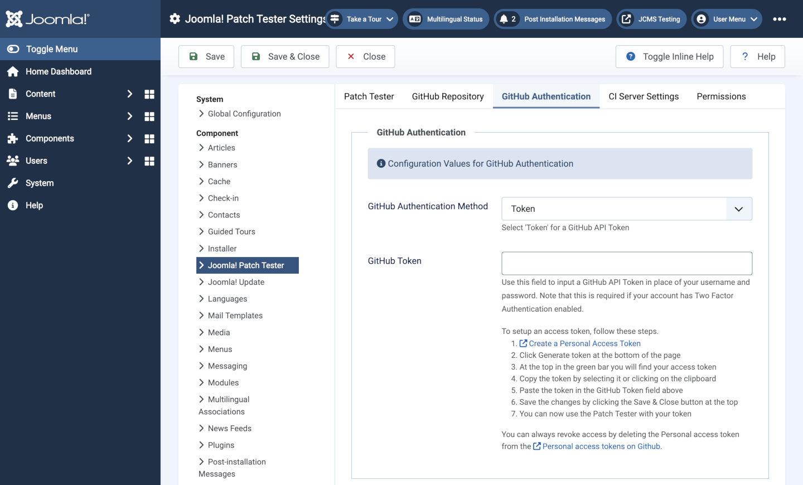
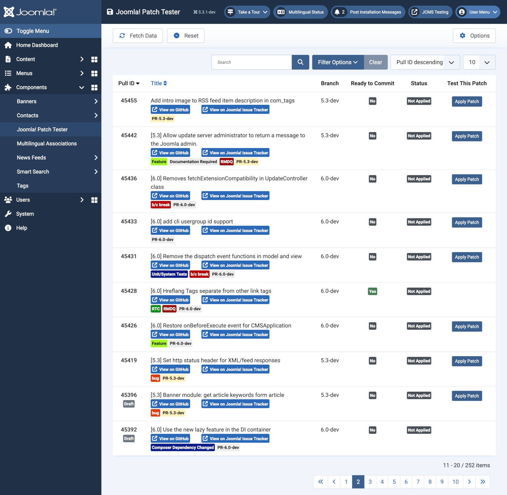

The Joomla! Patch Tester
========================

## Installation

Download the latest [Patch Tester zip file](https://github.com/joomla-extensions/patchtester) and save it for use in future installations. Install the Patch Tester using the *Upload Package File* method (System -> Install Extensions).

### Configuration

1. Select the **Joomla Patch Tester** from the Administrator menu.
2. Select the **Options** button from the Toolbar.
3. Select the **GitHub Authentication** tab.
4. In the **GitHub Token** field paste in the API Token you obtained for your GitHub account.
5. **Save & Close**

## Fetch data

In the *Joomla! Patch Tester* page select the **Fetch Data** button. After a few seconds you will see a list of items for testing (224 at the time of writing, February 2025, but this changes hourly).

It is worth spending some time on examination of the list. For example the first issue marked as a **bug** in red does not appear until page 3 today (10 items per page). The following screenshot is of page 4 today:

### Features to note

- **Pull ID** is used to sort the list in descending order so the most recent are at the top.
- The **View on GitHub** and **View on Joomla! Issue Tracker** links open those sites in new windows. The latter is used to look for testing instructions and reporting results.
- The coloured labels contain information about the pull request, such as *bug* or *Feature* and whether a test has an *NPM Resource Changed*.
- The **Branch** shows which Joomla branch the pull request was created for. You will see all pull requests for all branches in the list. Some pull requests may require testing against a specific branch but this is not always so.
- The **Apply Patch** button applies the patch created in the pull request to your test installation. If the patch involves an NPM Resource Change you need to use the command line to run `npm ci` or `npm run build:css` if the change only affects CSS files or `npm run build:js` if the change only affects JavaScript files. You can then follow the Test Instructions in the Issue Tracker to test the patch. When finished, *Revert* the patch and rerun `npm ci` if the patch involves an NPM Resource Change.

### Filter Options

To get started you might like to look through issues marked as `bug` to see if there is something you feel competent to test. Select *Filter Options* and you will find *bug* in the *Filter Label* list. Only 50 of those at the time of writing and only 4 of those in the 4.3 branch chosen for installation. That probably does not matter.

## Sample Data

Some pull requests require site content to demonstrate a problem and the proposed solution. Some require a multi-lingual site. Others may require an empty site or a particular Joomla! version. There are three sample data sets available:

- **Testing Sample Data** is only available on sites built for testing using a repository clone. It provides a good selection of testing data for testing in English only. Try this to start with.
- **Blog Sample Data** comes with all Joomla! installations and you may be familiar with it.
- **Multilingual Sample Data** also comes with all Joomla! installations and needs languages already installed and no previous sample data.

If you find yourself wanting to test something with the wrong sample data you could create a new test installation with different sample data or you could empty the database, delete configuration.php and do the Joomla! installation again.

## Language Installation

Normal language installation via the System -> Install -> Languages route may fail with a system message saying `Unable to detect manifest file.`. You can solve this problem as follows:

- In the **Extensions Languages** list select the *Details URL* link for the language you would like to install.
- In Firefox and Google Chrome a window will open showing a rendered xml file.
- In the *downloads* section copy the url for the zip file and paste it into the url bar of your browser.
- Save the downloaded zip file to be used for more installations.
- Use the **System -> Install -> Extensions** route to install the downloaded language zip file like an ordinary extension.
- Remember to enable the Content Language and the System - Language Filter plugin.

## Testing Procedure

When you have looked through the list of issues and seen something that you think you can test:

- Select the **View on Joomla! Issue Tracker** link.
- Read the Summary of Changes, Testing Instructions and any Comments.
    - It may be that the the pull request does what the author intended but more experienced developers see that it uses the wrong approach or will cause future problems. They may ask for changes or reject it completely. Defer testing until any comments have been satisfied!
- Have a look at the Diff to see how many files are changed and how extensive the changes are.
- In the Patch Tester apply the patch and see whether it does what it is supposed to do according to the Testing Instructions. Remember the `npm ci` command if the patch changes CSS or JavaScript.
- If you are satisfied that the pull request does what it is supposed to do and does not appear to have side effects go back to the Joomla Issue Tracker page.
    - Select the **Test This** button. A form opens for you to enter your test result.

After submission of your test result remember to *Revert* the patch and re-run `npm ci` if appropriate.
